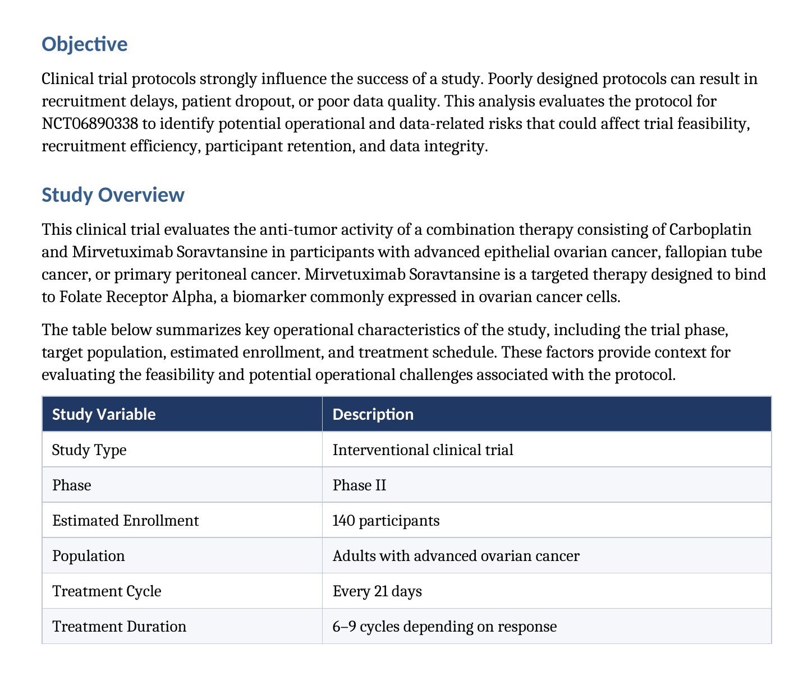
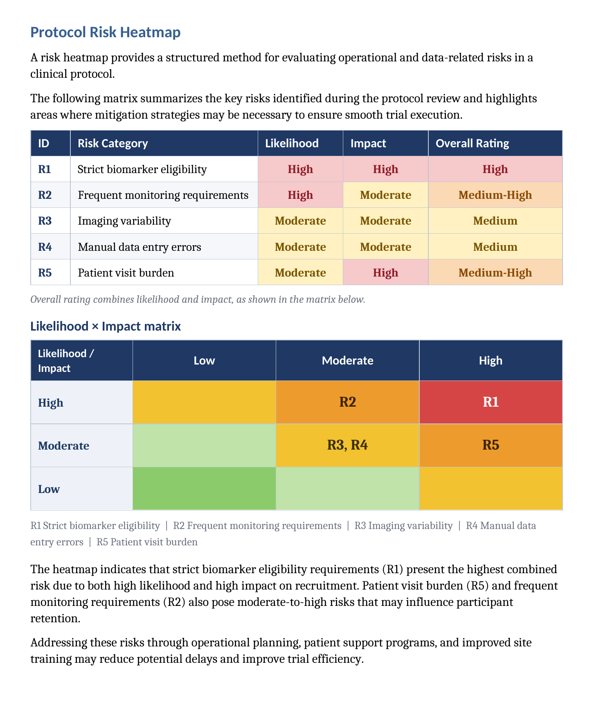
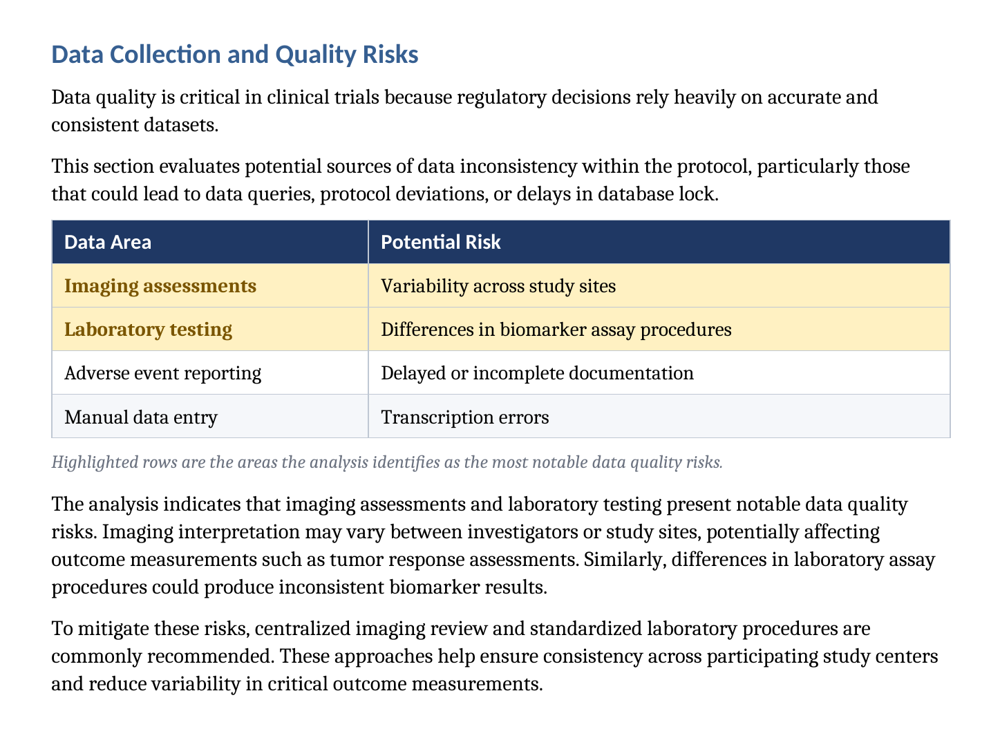
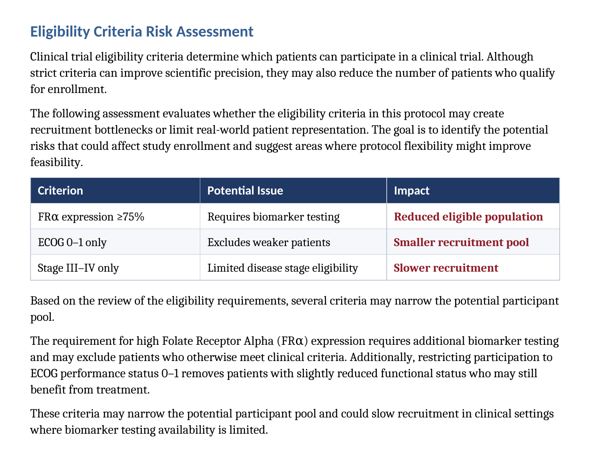
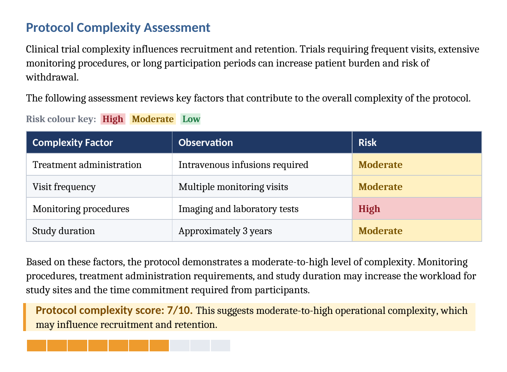

## Clinical Protocol Red-Flag Analysis

A structured review of a Phase III ovarian cancer clinical trial protocol, focused on identifying potential operational, data-quality, and feasibility risks that may require additional attention during study execution.

## Project at a Glance
Project Type: Independent clinical research portfolio project
Role: Clinical Data / Clinical Research Analyst
Study: Phase III ovarian cancer clinical trial
Source: ClinicalTrials.gov
Study ID: NCT06890338
Primary Tools: Clinical trial documentation, structured analysis, Excel
Output: Protocol Red-Flag Analysis PDF

## The Problem
Clinical trial protocols contain detailed requirements covering eligibility, treatment, assessments, safety, endpoints, visits, and data collection.
When these requirements are complex or open to interpretation, they can create operational challenges or increase the risk of inconsistent data collection.
This project demonstrates a structured approach to reviewing a clinical trial protocol and identifying areas that could require clarification, closer monitoring, or additional operational attention.

## What I Did
I reviewed the publicly available clinical trial information and analysed the protocol from a clinical research and data-quality perspective.

The review focused on:
- Study design and treatment structure
- Eligibility and exclusion requirements
- Study assessments
- Endpoint requirements
- Safety considerations
- Data collection requirements
- Operational complexity
- Potential data-quality risks
- Areas requiring clarification or follow-up

Rather than simply summarising the study, I examined how individual protocol requirements could affect study execution and the quality of collected clinical data.

## Analysis Approach
The analysis followed a structured workflow:

Protocol review → Requirement extraction → Risk identification → Red-flag classification → Potential impact assessment → Documentation

# Protocol Review
Key study characteristics and protocol requirements were identified from the available clinical trial information.

# Requirement Extraction
Relevant requirements were grouped into areas such as:
- Eligibility
- Treatment
- Assessments
- Endpoints
- Safety
- Data collection
- Study operations

# Red-Flag Identification
Potential areas of concern were identified where a requirement could contribute to:
- Missing or inconsistent data
- Data-entry ambiguity
- Increased site workload
- Timing or visit-compliance challenges
- Assessment complexity
- Query generation
- Monitoring requirements
- Protocol deviation risk

# Risk Interpretation
Each observation was considered in terms of its potential effect on clinical trial execution and data quality.
The purpose was not to declare that a protocol requirement was incorrect, but to identify areas that could deserve additional attention or clarification.

## Key Areas Reviewed

# Eligibility
Reviewed inclusion and exclusion requirements for potential interpretation or implementation challenges.

# Assessments
Considered the type, timing, and complexity of required study assessments and their implications for consistent data collection.

# Safety
Reviewed safety-related requirements and areas where accurate and timely documentation may be important.

# Data Quality
Considered potential sources of:
- Missing data
- Inconsistent entries
- Ambiguous requirements
- Query generation
- Delayed data cleaning

# Operations
Considered how protocol complexity could affect site workload, visit execution, assessment timing, and monitoring.

## Red-Flag Analysis
The analysis documented identified observations using a structured approach that considered:
Protocol area → Observation → Risk type → Potential impact → Recommended attention
This approach helped translate protocol language into practical clinical research and data-management considerations.

# Portfolio Evidence
Selected screenshots from the completed analysis are displayed below.

## Portfolio Evidence

Selected screenshots from the completed analysis are displayed below.

### Protocol Review

### Red-Flag Analysis

### Risk Assessment Heatmap

### Data Quality Red Flags

### Eligibility Red Flags

### Protocol Complexity

## Full Analysis
The complete protocol red-flag analysis is available as a PDF.
**[View the Full Protocol Red-Flag Analysis](Clinical_Protocol_Red_Flag_Analysis_NCT06890338.pdf)**

## Skills Demonstrated

- Clinical trial protocol review
- Clinical research operations
- Risk-based analysis
- Data-quality assessment
- Protocol requirement extraction
- Clinical research documentation
- Query and issue identification
- Scientific and technical writing
- GCP-informed clinical research thinking
- Structured problem solving

## Real-World Relevance
Protocol review is closely connected to clinical research operations and clinical data management.
Identifying potential sources of ambiguity, missing data, inconsistent assessments, or operational difficulty early can help teams determine where additional clarification, monitoring, training, or data-quality controls may be useful.
This project demonstrates my ability to move from clinical trial documentation to structured operational and data-quality analysis.

## Limitations
This is an independent portfolio project based on publicly available clinical trial information.
It is not a sponsor-issued protocol review or regulatory assessment.
The analysis does not replace review by investigators, clinical operations teams, data managers, statisticians, medical monitors, or regulatory professionals.
Some operational considerations may require access to additional sponsor documents that are not publicly available.

## Future Improvements
Future versions could include:
- Formal risk scoring
- Protocol deviation risk mapping
- Visit-window analysis
- Data-management implications
- Query-generation examples
- Site feasibility considerations
- Power BI visualisation
- Comparison with additional clinical trial documentation

## Project Outcome
This project demonstrates my ability to review clinical trial documentation, identify potential operational and data-quality risks, and communicate those observations in a structured format.

It also demonstrates how clinical research knowledge can be applied to practical clinical data and workflow analysis.

## Reference
The analysis was developed using publicly available clinical trial information from ClinicalTrials.gov.

"ClinicalTrials.gov" (https://clinicaltrials.gov/)
